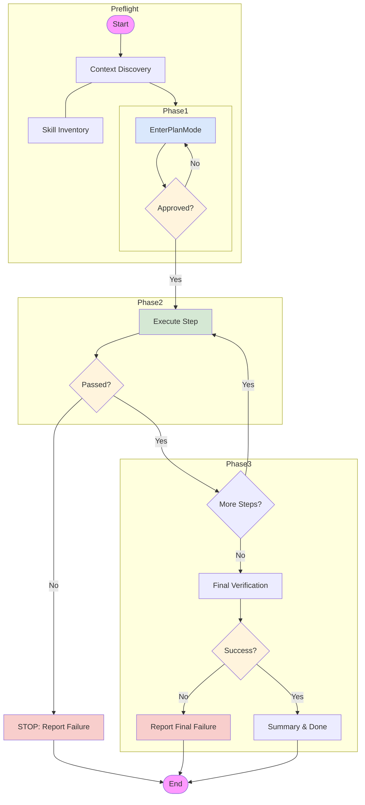

# Orchestrate Skill — Lifecycle Diagram

```mermaid
graph TD
    %% Pre-flight Phase
    subgraph Preflight
        Start([Start]) --> Discovery[Context Discovery]
        Discovery --- Skills[Skill Inventory]
        Discovery --> Phase1
    end

    %% Phase 1: Plan
    subgraph Phase1
        Plan[EnterPlanMode]
        Plan --> Approval{Approved?}
    end

    Approval -- No --> Plan

    %% Phase 2: Execute
    subgraph Phase2
        Approval -- Yes --> ExecuteStep[Execute Step]
        ExecuteStep --> StepCheck{Passed?}
    end

    StepCheck -- No --> ReportFailure[STOP: Report Failure]
    StepCheck -- Yes --> MoreSteps{More Steps?}
    MoreSteps -- Yes --> ExecuteStep

    %% Phase 3: Verify
    subgraph Phase3
        MoreSteps -- No --> FinalVerify[Final Verification]
        FinalVerify --> Success{Success?}
        Success -- No --> FinalReportFail[Report Final Failure]
        Success -- Yes --> Summary[Summary & Done]
    end

    Summary --> End([End])
    ReportFailure --> End
    FinalReportFail --> End

    %% Basic Styling
    style Start fill:#f9f
    style End fill:#f9f
    style Approval fill:#fff4dd
    style StepCheck fill:#fff4dd
    style Success fill:#fff4dd
    style ReportFailure fill:#f8cecc
    style FinalReportFail fill:#f8cecc
    style Plan fill:#dae8fc
    style ExecuteStep fill:#d5e8d4
```
